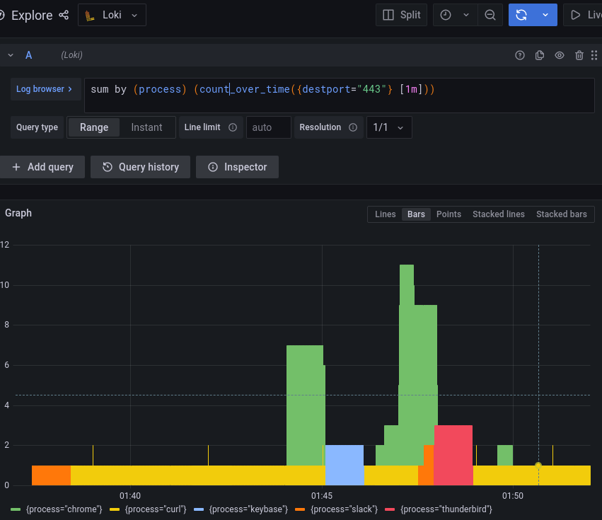

# egress-auditor

egress-auditor will monitor new outbound connections and generate appropriate
iptables rules (or logs, or ... depending on [output plugin](#outputs)).

Connections can be detected using several [methods](#inputs).

The goal is to audit what connections your system need to establish outside,
and this tool can help in several scenarios:

- audit egress connections and automatically display required iptables rules to
  allow these connections;

- when rules are in place, log all egress connections just before they are
  dropped by the chain (explicitly or by the default policy) and send alerts
  based on loki queries for instance

- let only connections be established if they are initiated by specific
  processes (TDB, requires nfqueue)

This is early alpha stuff.

## Quick start

```bash
# add an iptable rules on OUTPUT to send new connections to NFLOG
sudo iptables -I OUTPUT -m state --state NEW -p tcp -j NFLOG --nflog-group 100
go build . 
# start egress-auditor using the nflog input and the same group id used in iptables
sudo ./egress-auditor -i nflog -I nflog:group:100 -o iptables -O iptables:verbose:2
egress-auditor is running... press ctrl-c to stop
new TCP connection 192.168.1.229:60166 -> 146.148.13.123:443(https) by curl
^C # <- Ctrl+C pressed here
# [nflog] Line generated for curl running as ubuntu with command "curl https://www.devops.works"
# [nflog] Parent of this process was bash running as ubuntu
iptables -I OUTPUT -d 146.148.13.123 -p tcp -m tcp --dport 443 -j ACCEPT -m comment --comment "curl"
```

## Usage

See `-h` for help, and `-l` for the list of input/output plugins.

In a nutshell, inputs are added using `-i`, outputs using `-o`.

If a plugin needs an option, they are passed using `-I` for inputs and `-O` for
outputs. For those options, the required format is
`pluginame:optionname:optionvalue`.

For instance, to set verbosity to 2 for the iptables output plugin, the proper
invocation is:

```
... -O iptables:verbose:2
```

Of course, this implies the iptables output module has been loaded using `-o
iptables` in the same CLI. 

The `-R` option can be used to hide `egress-auditor` and it's arguments from
`ps` output. This allows for more sneaky auditing, preventing someone to spot
the program too easily and kill it.

For instance, when running:

```
sudo ./egress-auditor -R '[loop25]' ...
```

a call to `ps auwx | grep egress | grep -v grep` won't return any results,
since the process has been renamed to `[loop25]` (and hangs out with its other
loop kernel-threads friends). 

## Building

```
go build .
```

If you're lazy and do not want to type `sudo` when running `egress-auditor`,
you can give it some capabilities:

```
sudo setcap 'cap_net_admin=+ep' ./egress-auditor 
```

## Loki stack

If you want to play with egress captured logs in loki, you can start a
docker-compose stack in the _misc directory, then point egress-auditor at loki.

```
cd _misc
docker-compose up -d
cd ..
sudo iptables -I OUTPUT -m state --state NEW -p tcp -j NFLOG --nflog-group 100
sudo ./egress-auditor -i nflog -I nflog:group:100 -o loki -O loki:url:http://127.0.0.1:3100 -O loki:label:test=true,lokirules=yes,fizz=buzz
```

Then :

- [login](http://localhost:3333/) with `admin:admin`,
- create a [datasource](http://localhost:3333/datasources) with type 'Loki' and
  URL `http://loki:3100`
- click save and test, and got to the Explore panel to start playing, using
  this query for instance: `sum by (process) (rate({destport="443"} [1m]))`



## Available modules

Run `egress-auditor -l` to get an up to date list and their options.

### Inputs

- [x] nflog: captures using nflog iptable target
- [x] nfqueue (+ auto-allow using process filters)
- [ ] pcap (device + file, no proc info for the latter)
- [ ] ebpf

### Outputs

- [x] iptables
- [x] loki
- [ ] json (file + stdout)

## Caveats

- supports only TCP for now
- when using nflog, originating process might not be found for really short
  lived connections

## TODO

- UDP
- PTR lookups on destination ?
- pass down a logger to prevent logging mess
- `-C` : how many cnx to capture before bailing out
- `-t`: duration to capture before exiting
- `-debug`

## Licence

MIT

Contributions welcome.
